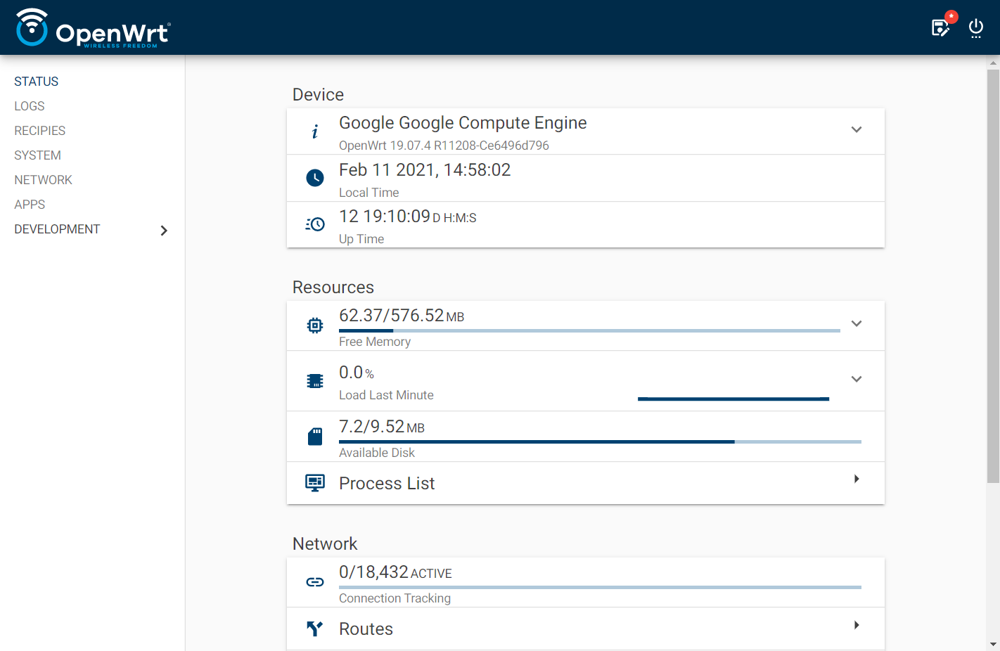
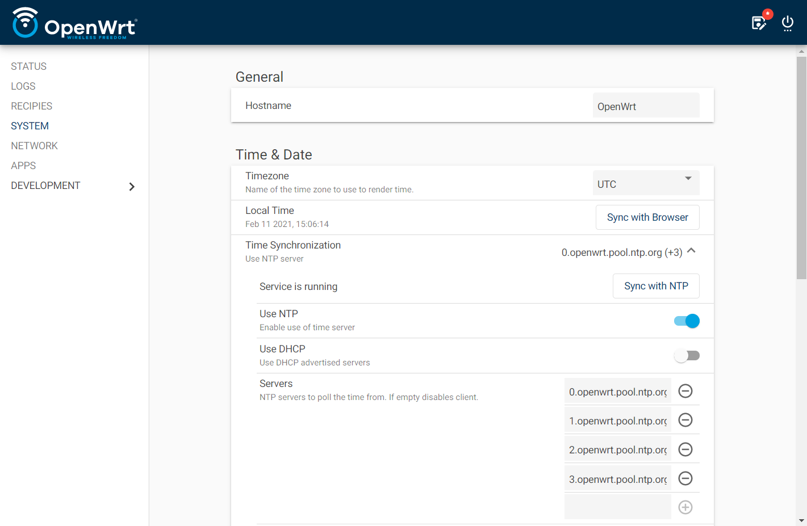
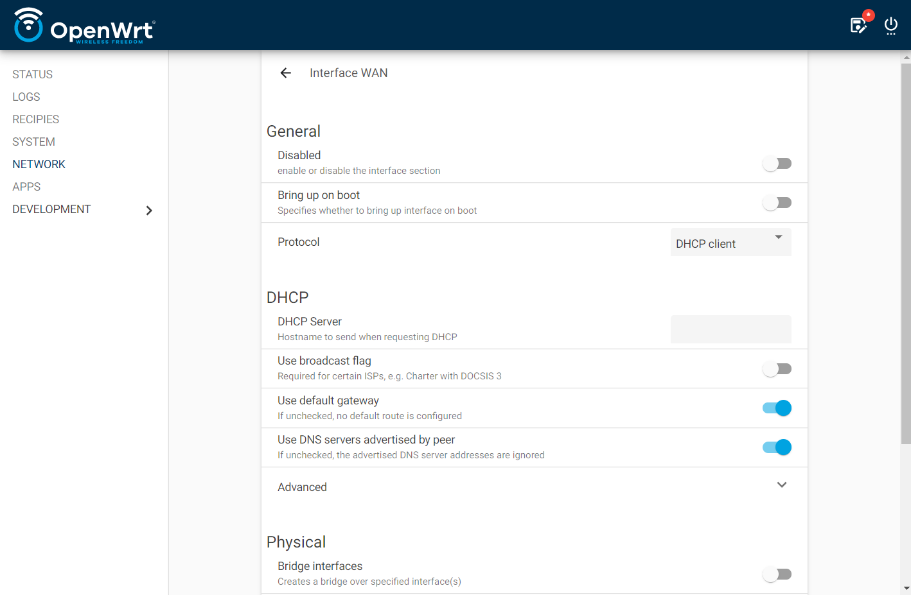
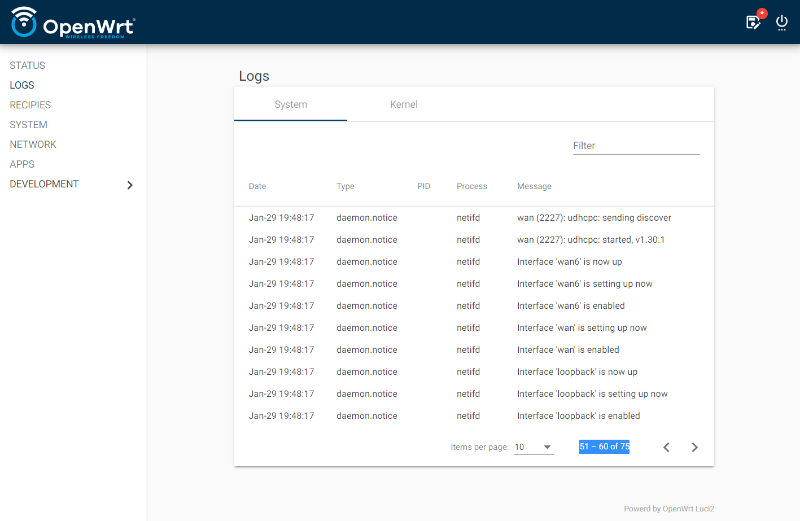
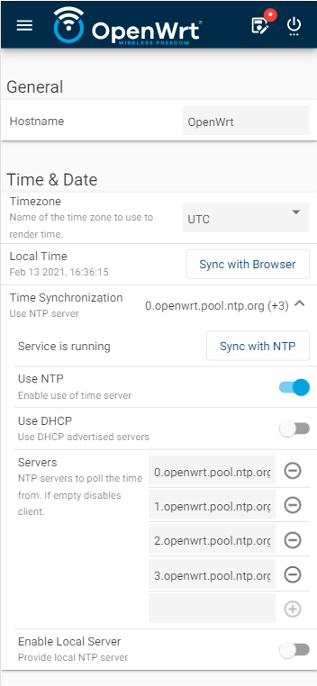
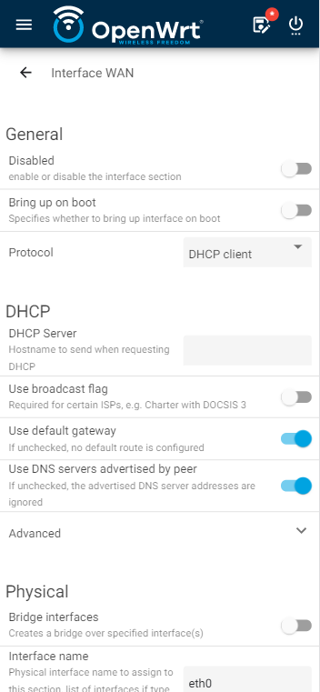
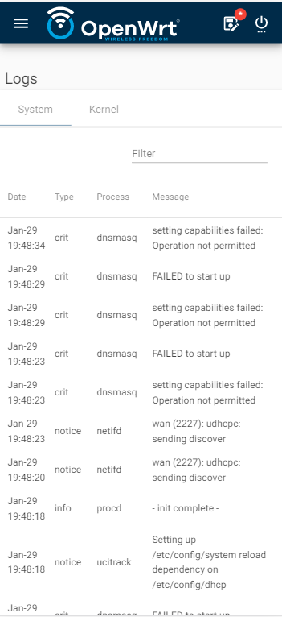

# Luci2

This is a complete rewrite of Luci, [OpenWrt’s](https://openwrt.org) web interface, with the goal of making it more modern looking, simpler to use and maintain and requiring less dependencies.

## Screenshots

### Desktop



<details>
<summary>
More...
</summary>





</details>
&nbsp

### Mobile

 

<details>
<summary>
More...
</summary>

 

</details>
&nbsp  
  
  
## Demo

You can try it live at
[Online OpenWrt](http://luci2.mywire.org:9080)
using:

_user_: `guest`

_password_: `guest`

# Design Principles

The main design principles are:

- Keep **strong separation of view/model/business logic**
- **Minimal dependencies**. No LUA. Only depend on Ubus rpcd helpers.
- Definitions of **views completely done in pure json**. No code needed on any specific framework to add apps

Some additional characteristics:

- Static web pages served, rendered on the client, interacting with the device with UBUS thru http calls

- Modern look & feel
- Responsive and working well on mobile.
- Core Developed using Angular and modern web development tooling. The framework could eventually be changed, but keeping the same API, all views could still work.
- Promote separation of concerns:
  - UCI configs definitions should be done as json schema
  - View definition as minimal json files, inheriting all UCI related from schema
  - Minimal API exposed from Luci2 to the views
  - All business logic should be in Ubus methods in the backend

# Current Status

Luci2 is currently under _slow_ development. It is possible to install and run it, but it will offer limited functionality.

You are encouraged to contribute to it’s development!

## Installing

Currently there is no package feed with compiled packages to directly install on the device.
To use it you will need to compile it yourself. The easiest way is to use [OpenWrt SDK](https://openwrt.org/docs/guide-developer/using_the_sdk).

You’ll need to add this repo to `feeds.conf`

```
src-git Luci2 https://github.com/jow-/luci-ng;release
```

You need to install `luci2-app-base`, which will pull all needed dependencies.

See [OpenWrt Feeds' Guide](https://openwrt.org/docs/guide-developer/feeds) for details.

# Developing Views

To completely define a view a number of files are needed, mostly json. Not all are necessary:

1. **UCI Schema**, describing the corresponding UCI config. Required only if the view manages UCI options.
2. **View definition**. The description of the UI and it’s behavior. In some simple cases can be omitted and generated automatically from the UCI schema.
3. **Menu/Route entry** to access the view. Or use predefined paths to include in hooks of base views.
4. **ACLs** defining the permissions needed to run de view, if applicable
5. **UBUS plug-in/script** with business logic, if needed.
6. Plain JS **client-side helper functions**. Mainly to post process Ubus responses with more complex logic. This is discouraged as the logic should reside in the Ubus method.

Documentation coming soon.

## License
